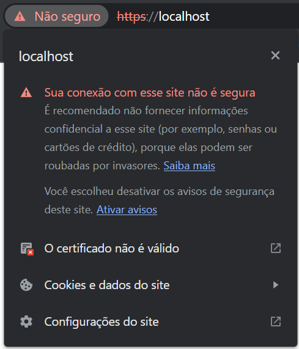

# 🔑 apache-ssl
Este repositório é um guia de como criar um Servidor apache (Em um container docker) configurado HTTPS, rodando no domínio localhost. Seguindo os passos deve ser possível configurar um também. Ou utilizar o que já está pronto, que é resultado desses passos.

## ✉ Criando o certificado SSL 

Para que o nosso servidor Apache possa utilizar o HTTPS, precisamos de um certificado que será utilizado para criptografar a comunicação do cliente com o servidor. (Navegador -> Servidor Apache). 

Podemos criar um par chave autoassinada e certificado com o OpenSSL em um único comando:

```bash
sudo openssl req -x509 -nodes -days 365 -newkey rsa:2048 -keyout /etc/ssl/private/apache-selfsigned.key -out /etc/ssl/certs/apache-selfsigned.crt
```

- **openssl**: esta é a ferramenta básica de linha de comando para criação e gerenciamento de certificados OpenSSL, chaves e outros arquivos.
- **req**: este subcomando especifica que queremos usar o gerenciamento X.509 de solicitação de assinatura de certificado (CSR). O “X.509” é um padrão de infraestrutura de chave pública aderido pelo SSL e o TLS para seu gerenciamento de chaves e certificados. Queremos criar um novo cert X.509, então estamos usando este subcomando.
- **x509**: isso modifica ainda mais o subcomando anterior dizendo ao utilitário que queremos criar um certificado autoassinado em vez de gerar uma solicitação de assinatura de certificado, como normalmente aconteceria.
- **nodes**: isso diz ao OpenSSL para pular a opção de proteger nosso certificado com uma frase secreta. Precisamos que o Apache consiga ler o arquivo, sem a intervenção do usuário, quando o servidor for iniciado. Uma frase secreta impediria que isso acontecesse porque teríamos que digitá-la após cada reinício.
- days 365: esta opção define a duração do tempo em que o certificado será considerado válido. Aqui, nós configuramos ela para um ano.
- **newkey rsa:2048**: isso especifica que queremos gerar um novo certificado e uma nova chave ao mesmo tempo. Não criamos a chave necessária para assinar o certificado em um passo anterior, então precisamos criá-la junto com o certificado. A porção rsa:2048 diz a ele para criar uma chave RSA que seja de 2048 bits.
- **keyout**: esta linha diz ao OpenSSL onde colocar o arquivo gerado de chave privada que estamos criando.
- **out**: isso diz ao OpenSSL onde colocar o certificado que estamos criando.

Após executar esse comando no linux, uma série de perguntas será feita, deve parecer com:


```bash
Country Name (2 letter code) [AU]:US
State or Province Name (full name) [Some-State]:New York
Locality Name (eg, city) []:New York City
Organization Name (eg, company) [Internet Widgits Pty Ltd]:Bouncy Castles, Inc.
Organizational Unit Name (eg, section) []:Ministry of Water Slides
Common Name (e.g. server FQDN or YOUR name) []:server_IP_address
Email Address []:admin@your_domain.com
```

> (Caso não tenha linux, ou não quiser gerar um, utilize o certificado que está na pasta /certificado)


[Fonte](https://www.digitalocean.com/community/tutorials/how-to-create-a-self-signed-ssl-certificate-for-apache-in-ubuntu-18-04-pt)


## 🖥 Configurando o servidor Apache

1. Crie um arquivo chamado `000-default.conf`. E insira nele o seguinte conteúdo:

```bash
<VirtualHost *:80>

  Redirect "/" "https://localhost/"
  ServerAdmin admin@localhost
  DocumentRoot /var/www/html
  ErrorLog ${APACHE_LOG_DIR}/error.log
  CustomLog ${APACHE_LOG_DIR}/access.log combined

</VirtualHost>

<VirtualHost *:443>

  SSLEngine on
  SSLCertificateFile /etc/apache2/ssl/certificado.pem
  SSLCertificateKeyFile /etc/apache2/ssl/chave-privada.pem

  ServerAdmin david@localhost
  DocumentRoot /var/www/html
  ErrorLog ${APACHE_LOG_DIR}/error.log
  CustomLog ${APACHE_LOG_DIR}/access.log combined

</VirtualHost>
```

Veja que está apontando que o nosso certificado e chave privada estarão em:

```bash
SSLCertificateFile /etc/apache2/ssl/certificado.pem
SSLCertificateKeyFile /etc/apache2/ssl/chave-privada.pem
```
Sendo assim nossos arquivos devem ser movidos para esse caminho na nossa imagem docker.

> (Esse arquivo está na pasta /configuracao)

[Fonte](https://dockerwebdev.com/tutorials/docker-php-development/)

## ⁉ Como utilizar o container desse repositório?

1. Ter o docker instalado.
2. Executar o comando `docker compose up -d` no diretório `/docker`.
3. O Container deve subir e passar a funcionar. `localhost` no navegador deve redirecionar para o HTTPS.
4. A pasta `/src` deve ser utilizada para colocar os código php.

OBS: O certificado será apresentado como inválido, porém isso não deve atrapalhar.


